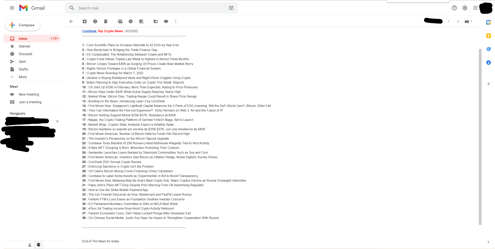

# Automated-email-for-coindesk.com
<h3> Python Program to automatically send the Titles of coindesk.com's headlines </h3>

       Enter the email Addresses for sender and receiver, receiver will receive the email consists today's date and coindesk.com newest headlines 

